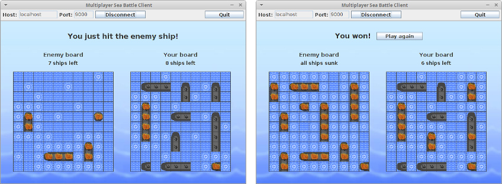

## Multiplayer Sea Battle
This is a client-server based multiplayer sea battle game. The server is capable of running multiple games for pairs of players at the same time. It's authoritative and it validates everything regarding game flow on its own side. Players connecting to the server through client application are automatically paired with other players waiting for a new game.

The game mechanic is very simple. Each player starts with a set of 10 ships randomly placed on a 10x10 board. First player to sink all the enemy ships gets to win the battle.

### Screenshots

### Usage
Start the server by running Server.jar, preferably from the command line with `java -jar Server.jar 9000 100`. Last two values are the server's listening port number and client limit. Default values of 9000 as a port number and 100 as client limit are used if none specified.

The client application may be possible to launch with a double click but this depends on an operating system and its file assocations. If it's not possible, then it should be done via the command line with `java -jar Client.jar`. Enter the server's host address and its port number in the window and press Connect button to get into the server.

### Building
Open Server, Client and Common projects in NetBeans IDE, then build Server and Client projects. Common project should be automatically used as a library for them. Executables will be deployed inside dist directories along with shared library.
